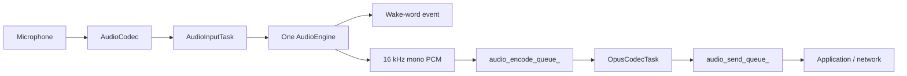

# Audio Service Architecture

`AudioService` owns one input engine and keeps codec I/O, Opus encoding/decoding,
and network queues independent from the chip-specific speech pipeline.

## Input engines

The old `AudioProcessor + WakeWord` combinations have been replaced by a single
`AudioEngine` interface. `AudioInputTask` reads PCM once and feeds exactly one
engine.

| Target | Engine | Wake word | Uplink processing |
| --- | --- | --- | --- |
| ESP32-S3 / ESP32-P4 | `AfeAudioEngine` | WakeNet inside AFE, or MultiNet fed from AFE output | FD AEC + VAD when audio processing is enabled |
| ESP32 / ESP32-C3 / ESP32-C5 / ESP32-C6 | `LiteAudioEngine` | Standalone WakeNet when configured | Raw mono PCM |

`AfeAudioEngine` owns a single FD AFE instance. WakeNet and voice uplink share
that instance, so enabling both no longer creates two AFE pipelines. For custom
MultiNet wake words, AFE fetch output is passed to `CustomWakeWord`; MultiNet is
not created on the smaller targets.

The MMR (two microphones plus reference) path selects `AFE_TYPE_FD` and
`AFE_MODE_LOW_COST`, retaining the ESP-SR profile's AEC/SE defaults.
The current MMR A/B test explicitly sets `AEC_NLP_LEVEL_NORMAL`, replacing
the previously observed `AGGR` default; no other acoustic settings change.
Other input layouts use the existing VC/HIGH_PERF profile with
`AEC_MODE_VOIP_HIGH_PERF` and `AEC_NLP_LEVEL_NORMAL` overrides.
Standalone NS and AGC are explicitly disabled. Do not infer current MMR NLP
strength from older single-microphone tuning or documentation.

At initialization, `AFE init config` logs AEC mode, NLP level, filter length,
and AEC/SE/NS/AGC flags from the configuration object after creation. These
are configuration values, not later runtime enable/disable state; the existing
`print_pipeline` output describes the created graph. No acoustic settings are
changed by this logging.

Before starting its fetch task, the engine verifies that the AFE reports
16 kHz, the codec's interleaved channel count, and positive feed/fetch frame
lengths. A mismatch destroys the instance and fails initialization. Codec
capture may still run at 24 kHz: `AudioService` resamples all input channels
before feeding AFE. These checks and logs run only during initialization,
independently of the disabled PCM-dump and periodic-diagnostic features.

When wake-word audio upload is enabled, the most recent two seconds of PCM are
stored in a single 64 KB PSRAM ring buffer. WakeNet and MultiNet share the same
cache implementation, and the encoder reads it one Opus frame at a time. This
avoids the previous per-chunk internal-SRAM allocations and temporary PCM
concatenation buffer.

## Input data flow

Wake-word detection and voice processing are independent runtime states on the
same engine. On AFE targets, AEC stays active while wake-word detection is active
so playback reference remains available for wake-up during device playback. It
also stays active during voice processing when device AEC is requested.

## Output data flow

## Tasks and power management

- `AudioInputTask` reads codec input and feeds the selected engine.
- `AudioOutputTask` drains decoded PCM to the codec output.
- `OpusCodecTask` encodes uplink PCM and decodes downlink packets.
- `AfeAudioEngine` has its own AFE fetch task on S3/P4.

The audio power timer still enables and disables codec ADC/DAC channels based on
activity; the engine refactor does not change that policy.
